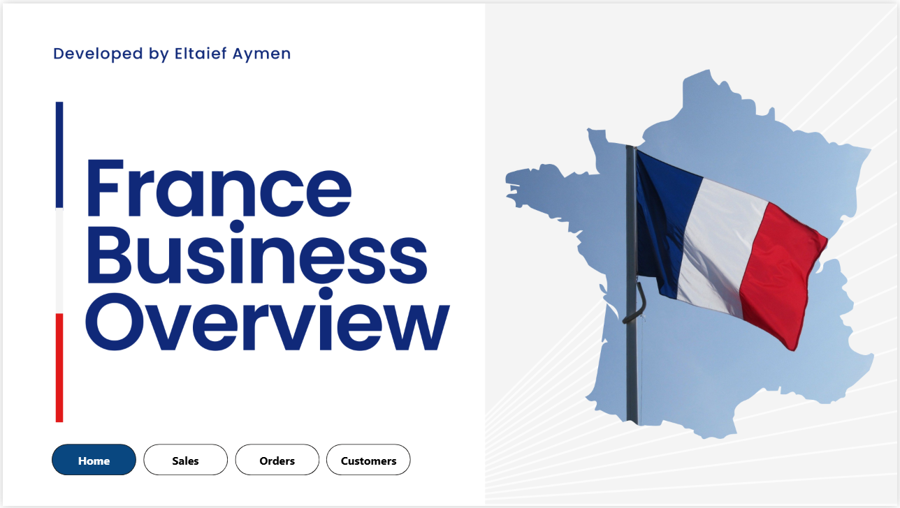
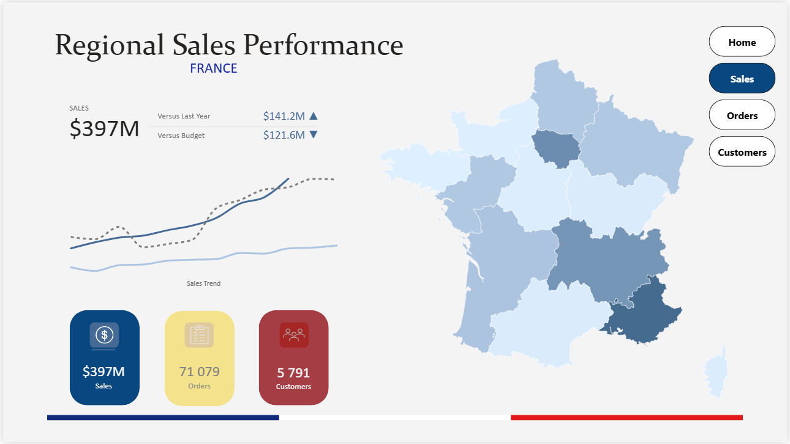
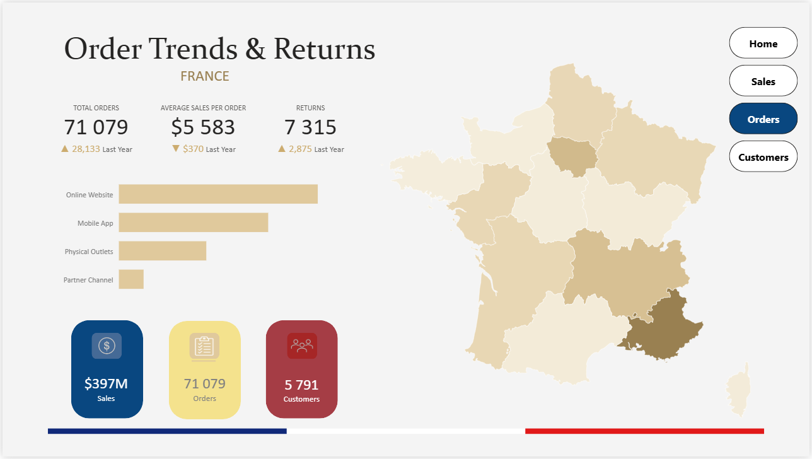
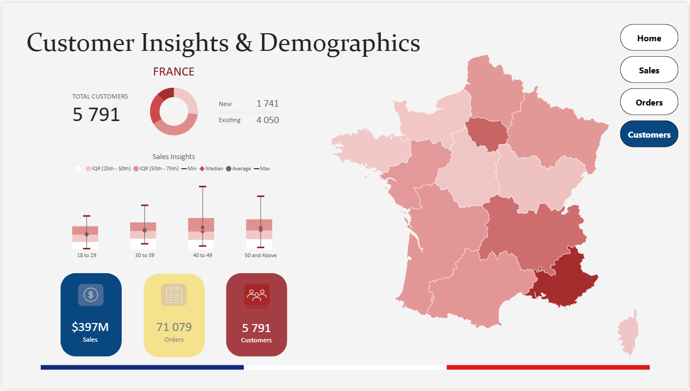

# France Business Overview (Power BI)

## 🔎 Project Overview
This project is a **Business Intelligence solution** built with **Power BI** to analyze **regional sales, orders, and customer data across France**.  
It leverages interactive dashboards to provide executives and analysts with actionable insights on **sales performance, customer behavior, and order trends**.

The dataset includes **sales transactions, customer profiles, products, and budget forecasts**.  
The dashboards are designed for **strategic decision-making** with clear KPIs, regional breakdowns, and time-based trends.

---

## 🚀 Dashboards Included

### 🏠 Home Dashboard

### 💰 Sales Regional Dashboard

### 📦 Orders Regional Dashboard

### 👥 Customers Regional Dashboard

---

## 🛠️ Tech Stack
- **Power BI** → Dashboard design & interactive reporting  
- **Excel / Data Modeling** → Fact & Dimension tables (Orders, Customers, Products, Regions, Budget, Dates)  
- **DAX & Power Query** → KPIs, calculated columns, and transformations  

---

## 📈 Key Skills Demonstrated
- Data modeling and relationships (fact/dimension star schema)  
- KPI definition and DAX measures (Sales, Orders, CLV, Returns)  
- Dashboard design principles (clarity, navigation, executive summary)  
- Business storytelling with data (Sales trends, regional analysis, customer insights)  
